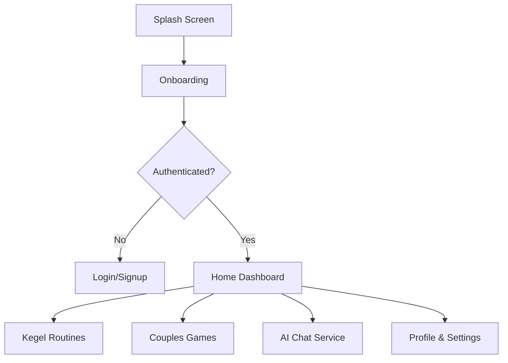

# 🌿 Velmora Health App

[](https://flutter.dev)
[](https://firebase.google.com)
[]()

**Velmora** is a high-end health and wellness ecosystem designed specifically for couples. It blends scientific wellness routines (like Kegel exercises) with interactive gamification and personalized AI guidance to enhance relationship health and intimate well-being.

---

## 🚀 Platform Architecture

The Velmora ecosystem consists of two integrated platforms:

### 👤 1. User Application (Mobile)
A feature-rich Flutter application designed for end-users to manage their wellness journey.
*   **Intelligent Onboarding**: Tailored experience setup.
*   **Intimate Wellness**: Guided Kegel routines with progress analytics.
*   **Connection Games**: Gamified interactions to deepen partner proximity.
*   **AI Relationship Guru**: Real-time guidance and support.

### 🛠 2. Admin Control Center
A powerful administrative interface for platform oversight and data management.
*   **User Lifecycle Management**: Monitor growth and manage accounts.
*   **Security & Compliance**: Secure password synchronization and audit logs.
*   **AI Orchestration**: Direct control over the AI's persona and system instructions.

---

## 🔄 Application Flow

### User Journey


---

## 📸 User Experience Demo

<div align="center">

| Dashboard & Home | Games & Connection | Kegel Routines |
|:---:|:---:|:---:|
|  |  |  |
| **Main Hub** | **Gamification** | **Wellness Progress** |

| Advanced Training | Challenges | Analytics |
|:---:|:---:|:---:|
|  |  |  |

| Community/Social | Personalization | Settings |
|:---:|:---:|:---:|
|  |  |  |

| AI Guidance | Future Features |
|:---:|:---:|
|  |  |

</div>

---

## 🏗 Admin Panel

The Admin Panel allows for real-time monitoring and configuration of the Velmora ecosystem.

> [!NOTE]
> **Admin Demo**: Screenshots of the Admin Dashboard and User Management interface will be added here in the next phase of documentation.

---

## 🛠 Technical Setup

### Prerequisites
- **Flutter**: `^3.19.0`
- **Dart**: `^3.3.0`
- **Firebase**: Project configured with Auth & Firestore.

### Getting Started
1. **Clone & Install**:
   ```bash
   git clone https://github.com/HassanAmeer/velmora_health_app.git
   flutter pub get
   ```
2. **Environment**: Setup your `firebase_options.dart` in the `lib` folder.
3. **Execution**:
   ```bash
   flutter run --flavor development
   ```

---

## 🔒 License
Proprietary Software. © 2024 Velmora Team.